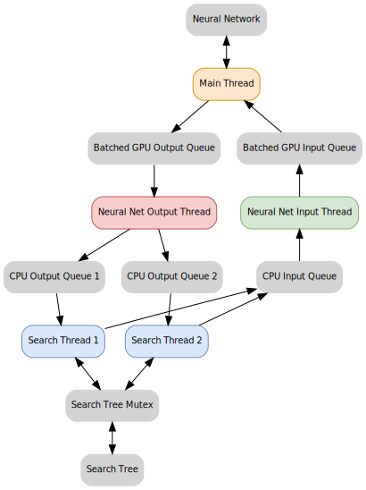

# Training an Othello-Playing Agent with AlphaZero

This project implements an Othello-playing agent based on [the AlphaZero algorithm](https://arxiv.org/abs/1712.01815). A randomly initialized neural network generates self-play data, guided by Monte Carlo Tree Search (MCTS). The neural network is then trained to predict optimal moves and expected game outcomes from this self-play data. Through iterative cycles of self-play and training, the agent progressively refines its strategy and performance.

While AlphaZero has been widely studied, existing implementations often prioritize simplicity over efficiency. This project focuses on providing a carefully optimized implementation of AlphaZero specifically tailored for the game of Othello. It achieves this through efficient C++ code, multi-threading, and thoughtful optimization, enabling the agent to perform up to 3,600 simulations per second.

## Implementation Details

### Game Representation

The Othello board consists of an 8×8 grid, where each square can be empty, black, or white. Conveniently, the 64 squares align perfectly with a 64-bit integer, allowing each bit to represent the state of a square for a specific player. This representation enables the use of efficient bitwise operations for tasks such as finding legal moves and updating the board state, resulting in improved performance and reduced memory usage.

### Monte Carlo Tree Search (MCTS)

The original AlphaZero algorithm uses a multi-threaded MCTS implementation to increase GPU utilization. Unfortunately, dominate neural network libraries use Python, which is not well-suited for multi-threading due to the Global Interpreter Lock (GIL). To address this limitation, this project uses a Cython extension module to implement MCTS in mixed C++ and Python code, where the GIL can be released in many code paths. I am also working on a pure C++ implementation using nanobind bindings for cleaner code and improved performance.

During MCTS, multiple threads run in parallel to ensure efficient utilization of both CPU and GPU resources:

- **Search Threads:** These threads traverse the search tree to select the best moves. When a new node needs to be evaluated and expanded, the search thread sends the board position features to the neural net input thread and waits for the neural net output thread to return the predicted policy and value.

  While the search tree is protected by a mutex, the mutex is intentionally released when a thread is waiting for neural network evaluation. This prevents other threads from being unnecessarily blocked and allows continued progress in the search tree. To avoid multiple threads selecting the same node for evaluation during this waiting period, virtual loss is applied. At any given time, one search thread actively traverses the search tree while others wait for neural network evaluation. This configuration prioritizes maximizing GPU utilization, as keeping the GPU consistently busy is crucial for overall performance.
- **Neural Net Input Thread:** This thread collects input features from the search threads, transfers them to the GPU, batches them together, and sends them to the main thread for neural network inference.
- **Main Thread:** The main thread receives the batched input tensors from the neural net input thread, runs inference on the neural network, and passes the predicted policies and values to the neural net output thread.
- **Neural Net Output Thread:** This thread collects the batched output tensors from the main thread, transfers them back to the CPU, and dispatches the results to the corresponding search threads.

Another implementation detail is the use of a contiguous, variable-sized vector with reserved space to store the search tree, instead of allocating nodes individually. This approach minimizes memory fragmentation and avoids the overhead of managing numerous small memory allocations. As long as the number of nodes stays within the reserved capacity, the vector maintains its allocated memory, significantly reducing the performance cost associated with dynamic memory allocation and deallocation.

### Neural Network

We use the same neural network architecture as described in the [AlphaGo Zero paper](https://discovery.ucl.ac.uk/id/eprint/10045895/1/agz_unformatted_nature.pdf): a ResNet with 19 residual blocks, implemented using PyTorch. One simplification we introduce is using only the current board position as input, rather than including the eight most recent positions. This simplification is justified by the rules of Othello, which do not require move history to determine the legality of a move. Additionally, the history does not provide meaningful information for improving move quality in this game.
